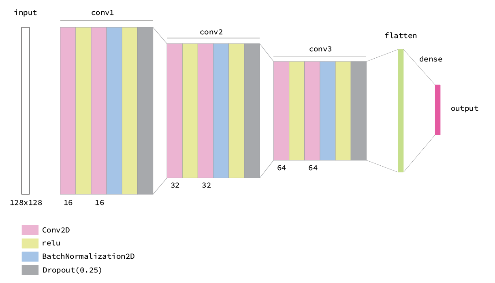

# My CNN Circle Detector Workshop

Author: jotaro shigeyama

Can you predict size / position of a circle by CNN?

## Tutorial

### Image sources

[image captioning dataset, random images](https://www.kaggle.com/shamsaddin97/image-captioning-dataset-random-images)

### Generating synthetic data

`python generate_data.py` : generates cropped images with a circle with various sizes and positions. (default 128x128)

### Training

`python train.py`

## Network Architecture

TBD:

